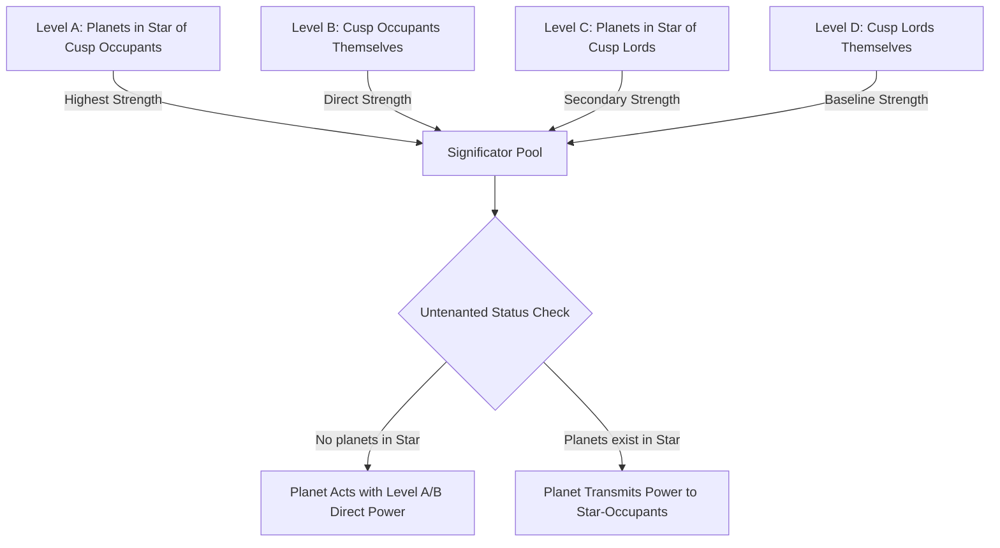

# Krishnamurti Paddhati (KP System) — Master Knowledge Vault & Complete Stellar Astrology Compendium

> **Compiled from 67 Classical & Modern KP Treatises in Workspace:**
> - *KP Readers I to VI* by Prof. K.S. Krishnamurti (Casting, Fundamentals, Predictive Stellar, Marriage & Children, Transits, Horary)
> - *Astro Secrets & KP* (Vols 1–6)
> - *KP Sublord Speaks / Cuspal Interlinks Theory* by S.P. Khullar (SPK)
> - *KP Ezine Archives (2007–2021)*
> - *KP Navratnamala & Advanced Stellar Padhdhati*
> - *Rules of Krishnamurti Paddhati (rules.md §21)*

---

## 1. Foundational Epistemology & Core Postulates of KP

### 1.1 Why Traditional Parashari Astrology Fails in Precision
In classical whole-sign Parashari astrology, twins born 5 minutes apart receive almost identical Rashi charts, Navamsas, and Vimshottari Dasha balances. Yet one becomes a wealthy doctor and the other passes away in infancy. 
Prof. K.S. Krishnamurti discovered that:
1. **The Constellation (Nakshatra) is too broad**: A $13^\circ 20'$ arc lasts ~53 minutes of rising ascendant. It indicates many contradictory matters.
2. **The Sub-Division (Sub-Lord) is the decider**: Dividing each Nakshatra proportionally into 9 unequal parts based on the Vimshottari Dasha spans ($120$-year cycle) isolates micro-arcs as small as $00^\circ 40' 00''$ (Sun sub in Venus star), changing every ~2.5 minutes of birth time.
3. **Placidus Semi-Arc Cusp vs Whole Sign**: Houses are not equal $30^\circ$ blocks. In KP, house boundaries are determined by astronomical spherical trigonometry (Placidus unequal house system), meaning a sign may hold 2 cusps, or a house may encompass 2 different signs.

### 1.2 The 4 Golden Axioms of Krishnamurti Paddhati
1. **Axiom I (The Source / Matter)**: 
   $$\text{A Planet offers the results of its Constellation (Star) Lord, not its own sign lordship.}$$
2. **Axiom II (The Final Verdict / Quality of Result)**: 
   $$\text{The Sub-Lord of the Planet decides whether the matter initiated by the Star Lord will fructify favorably or unfavorably.}$$
3. **Axiom III (The Cusp Decides the Promise)**: 
   $$\text{Whether a specific life event is promised at all is judged ONLY from the Sub-Lord of the relevant Cuspal Point (Cuspal Sub-Lord - CSL).}$$
4. **Axiom IV (The Unoccupied / Untenanted Planet Rule)**: 
   $$\text{A planet that has NO other planet posited in its constellations acts as a DIRECT significator of the house it occupies and the houses it owns.}$$

---

## 2. Mathematical Architecture: The 4-Tier Stellar Chain & 249 Sub-Divisions

Every celestial point $\lambda \in [0^\circ, 360^\circ)$ has 4 simultaneous rulers:

$$\text{Longitude } \lambda \longrightarrow \Big( \text{Sign Lord} \longrightarrow \text{Star Lord} \longrightarrow \text{Sub-Lord} \longrightarrow \text{Sub-Sub Lord (SSL)} \Big)$$

```
┌───────────────────────────────────────────────────────────────────────────┐
│                           ZODIAC (360°)                                   │
├─────────────────────┬─────────────────────────────────────────────────────┤
│ 12 RASHIS (30° ea)  │ Ruled by 7 classical planets + Rahu/Ketu in KP      │
├─────────────────────┼─────────────────────────────────────────────────────┤
│ 27 NAKS (13°20' ea) │ Ruled by 9 planets (Ketu → Mercury in Vimshottari)  │
├─────────────────────┼─────────────────────────────────────────────────────┤
│ 249 SUBS (Unequal)  │ Sub-arc = 13°20' × (Lord's Dasha Years / 120)       │
├─────────────────────┼─────────────────────────────────────────────────────┤
│ 2187 SSSL (Micro)   │ Micro-timing down to exact seconds of arc           │
└─────────────────────┴─────────────────────────────────────────────────────┘
```

### 2.1 Sub-Arc Duration Formula (Proportional Vimshottari Division)
For a constellation of span $13^\circ 20' = 800'$:

$$\text{Span of Sub-Lord } P = 800' \times \frac{\text{Vimshottari Years of } P}{120}$$

| Sub-Lord | Vimshottari Years | Sub Span (Deg / Min / Sec) | Arc in Minutes |
|:---|:---:|:---:|:---:|
| **Sun** | 6 | $00^\circ 40' 00''$ | $40.0'$ |
| **Moon** | 10 | $01^\circ 06' 40''$ | $66.67'$ |
| **Mars** | 7 | $00^\circ 46' 40''$ | $46.67'$ |
| **Rahu** | 18 | $02^\circ 00' 00''$ | $120.0'$ |
| **Jupiter** | 16 | $01^\circ 46' 40''$ | $106.67'$ |
| **Saturn** | 19 | $02^\circ 06' 40''$ | $126.67'$ |
| **Mercury** | 17 | $01^\circ 53' 20''$ | $113.33'$ |
| **Ketu** | 7 | $00^\circ 46' 40''$ | $46.67'$ |
| **Venus** | 20 | $02^\circ 13' 20''$ | $133.33'$ |
| **Total** | **120** | **$13^\circ 20' 00''$** | **$800.0'$** |

*Note on 249 Count:* In 27 Nakshatras, $27 \times 9 = 243$ subs. However, in signs where a Nakshatra straddles a $30^\circ$ sign boundary (Aries/Taurus, Gemini/Cancer, Leo/Virgo, Libra/Scorpio, Sagittarius/Capricorn, Aquarius/Pisces), the sub is split into 2 parts across the boundary. Exactly **6 subs are split**, giving $243 + 6 = \mathbf{249}$ table entries.

---

## 3. The 4-Step Theory & Significator Hierarchy (Levels A, B, C, D)

To determine which houses a planet signifies, evaluate all four levels in descending order of strength:



### 3.1 Formal Hierarchy Definitions:
*   **Level A (Strongest)**: Planet posited in the constellation of an occupant of house $H$.
*   **Level B**: Planet posited in house $H$ itself (gains extraordinary power if it has no planets in its stars).
*   **Level C**: Planet posited in the constellation of the lord of house $H$.
*   **Level D (Weakest)**: Planet that is the lord of house $H$.

### 3.2 The Node Representation Theorem (Rahu & Ketu as Super-Significators)
Rahu and Ketu do not own physical houses, but act as the strongest significators in a chart by representing:
1. The **Planet with which they are conjunct**.
2. The **Planet which aspects them** (special 5/9 and 7 aspects).
3. The **Lord of the Constellation** in which they are posited.
4. The **Lord of the Sign** in which they are posited.

$$\text{Strength Order of Representation: } \text{Conjunction} > \text{Aspect} > \text{Star Lord} > \text{Sign Lord}$$

---

## 4. Master Cuspal Sub-Lord (CSL) Rulebook: Life Event Formulas

In KP, **the Cuspal Sub-Lord of a house is the gatekeeper**. If the CSL signifies favorable house groupings, the event happens; if it signifies the 12th from those houses (negation houses), the event is denied.

| Life Domain | Primary Cusp | Fruitful Houses (Yes) | Negation / Barren Houses (No) | Golden CSL Rule & Classical Quotation |
|:---|:---:|:---:|:---:|:---|
| **Longevity & Health** | **1st & 8th** | $1, 3, 8, 11$ | $6, 8, 12$ (Disease), $2, 7$ (Maraka), Badhaka | *If 1st CSL is in star of planet signifying 6/8/12, native suffers chronic ill-health. If signifying 1/5/11, long robust life.* |
| **Wealth & Inflow** | **2nd & 11th** | $2, 6, 10, 11$ | $5, 8, 12$ (Loss / Outflow) | *2nd CSL in sub of 2, 6, 11 brings continuous wealth. In sub of 12, expenses exceed earnings.* |
| **Higher Education** | **4th & 9th** | $4, 9, 11$ | $3, 8$ (Failure / Dropout) | *4th CSL connected to 4, 9, 11 gives university degrees. 4th CSL in 8 with Mars/Rahu indicates technical engineering.* |
| **Childbirth / Progeny** | **5th** | $2, 5, 11$ | $1, 4, 10$ (12th from 2, 5, 11) | *5th CSL in star of planet signifying 2, 5, 11 promises child. If in sub of barren sign (Gemini, Leo, Virgo) and 1/4/10, no progeny.* |
| **Disease / Recovery** | **6th** | $6$ (Disease), $5, 11$ (Cure) | $1, 6, 8, 12$ (Prolonged sickness) | *6th CSL signifying 5 and 11 indicates rapid recovery without surgery. Signifying 8 and 12 indicates hospitalization and surgery.* |
| **Marriage & Union** | **7th** | $2, 7, 11$ | $1, 6, 10$ (Separation / Divorce) | *7th CSL in star/sub of 2, 7, 11 confirms marriage. If 7th CSL is in star of a planet signifying 1, 6, 10, separation is certain.* |
| **Foreign Travel / Settlement** | **12th & 9th** | $3, 9, 12$ | $4, 11$ (Return to homeland) | *12th CSL in star of a planet signifying 3 (leaving home), 9 (long journey), 12 (foreign land) gives foreign residence.* |
| **Career & Promotion** | **10th & 6th** | $2, 6, 10, 11$ | $5, 9$ (Loss of job / Retirement) | *10th CSL signifying 2, 6, 10, 11 brings elevation and executive power. Signifying 5, 9 causes resignation.* |
| **Property & Real Estate** | **4th** | $4, 11, 12$ | $3, 6, 8$ | *4th CSL in star of 4 and 11 gives house purchase. In star of Mars (immovable property) or Venus (vehicles).* |
| **Winning Litigation / Contests** | **6th & 11th** | $6, 11$ | $12, 5$ | *6th CSL connected to 11th house gives victory over rivals and winning of court trials.* |

---

## 5. Horary Astrology (Prasna 1–249 Engine)

When a seeker asks a question, a number between **$1$ and $249$** is provided.

```
[Seeker provides Horary Number 1-249]
                │
                ▼
[Number sets EXACT Ascendant Longitude from 249 Table]
                │
                ▼
[Calculate Placidus Houses & Planetary Positions for Query Moment]
                │
                ▼
[Step 1: Check Moon's Sub-Lord (Querent's Genuine Intention)]
    ├── If Moon CSL signifies query matter → Question is GENUINE & SINCERE
    └── If Moon CSL negates matter → Question is FRIVOLOUS / FALSE
                │
                ▼
[Step 2: Check Primary Cuspal Sub-Lord (CSL)]
    ├── Fruitful Significators → POSITIVE YES
    └── Negation Significators → DEFINITIVE NO
                │
                ▼
[Step 3: Timing via Ruling Planets & Dasha-Bhukti-Antara]
```

---

## 6. Ruling Planets (RP) Theory & Precision Birth Time Rectification

The **Ruling Planets** at the exact moment of astrological judgment/query are the divine clock hands that reveal the active cosmic signatories.

### 6.1 The 5 Canonical Ruling Planets:
1. **Lagna Star Lord (LStL)**
2. **Lagna Sign Lord (LSL)**
3. **Moon Star Lord (MStL)**
4. **Moon Sign Lord (MSL)**
5. **Day Lord (Lord of the Weekday at sunrise)**

*Rule on Nodes in RP:* If Rahu or Ketu is conjunct or aspected by any Ruling Planet, or occupies the sign/star of an RP, **the Node replaces that planet and takes precedence**.

### 6.2 The KP Birth Time Rectification Algorithm:
$$\text{Lagna Sub-Lord at Birth MUST be a Ruling Planet at the moment of Rectification.}$$
$$\text{Lagna Star Lord at Birth MUST be connected to the Moon's RP at Rectification.}$$

If a native's recorded birth time gives Lagna Sub-Lord as Mars, but Mars does not appear in the Ruling Planets, shift the Ascendant degree forward/backward to the nearest Sub-Lord that matches the strongest Ruling Planet.

---

## 7. Timing of Events: Transit & Dasha Synchronization

An event promised by the Cuspal Sub-Lord fructifies when the **Dasha**, **Bhukti (AD)**, **Antara (PD)**, and **Transits** simultaneously synchronize on fruitful significator planets:

1. **Dasha Lord**: Must be a fruitful significator of the event.
2. **Bhukti Lord**: Must signify the primary and supporting houses.
3. **Antara Lord**: Pinpoints the active month/weeks.
4. **Transit Trigger**:
   - **Sun Transit**: Sun must transit the Star or Sub of a fruitful significator.
   - **Moon Transit**: Moon transits the exact fruitful Sub on the day of the event.
   - **Jupiter / Saturn Transit**: Double transit confirms the macro-window.

---

## 8. S.P. Khullar (SPK) Cuspal Interlinks (CSI) & Sub-Sub Lord (SSL) Framework

S.P. Khullar expanded Guruji's sublord theory into **Cuspal Interlinks (CSI)** using the Sub-Sub Lord (SSL):

```
Planet Longitude ───► Sign Lord ───► Star Lord ───► Sub-Lord ───► Sub-Sub Lord (SSL)
                         │              │              │                 │
                      (House)       (Involvement)  (Commitment)     (Final Climax)
```

1. **Involvement (Star Lord)**: The Star Lord establishes which houses are *involved* in the query.
2. **Commitment (Sub-Lord)**: The Sub-Lord confirms which houses are *committed* (benefic vs malefic).
3. **Final Climax (Sub-Sub Lord)**: The SSL delivers the final degree of success, failure, or neutral settlement.

---

## 9. Comprehensive 249 Zone Mapping Reference Table (Sample Structure)

```
========================================================================================
No.  Sign      Span (From - To)        Sign Lord  Star Lord  Sub Lord   Significations
========================================================================================
1    Aries     00°00'00" - 00°46'40"   Mars       Ketu       Ketu       Head, Start, Fire
2    Aries     00°46'40" - 03°00'00"   Mars       Ketu       Venus      Art, Passion
3    Aries     03°00'00" - 03°40'00"   Mars       Ketu       Sun        Authority, Pride
4    Aries     03°40'00" - 04°46'40"   Mars       Ketu       Moon       Impulse, Water
5    Aries     04°46'40" - 05°33'20"   Mars       Ketu       Mars       Courage, Conflict
6    Aries     05°33'20" - 07°33'20"   Mars       Ketu       Rahu       Sudden surges
...
117  Virgo     18°40'00" - 20°33'20"   Mercury    Moon       Mercury    Analytics, Code
...
249  Pisces    28°46'40" - 30°00'00"   Jupiter    Mercury    Saturn     Dissolution, End
========================================================================================
```

---

## 10. Engine Implementation Reference (`jyotish_engine/computations/kp.py`)

In your calculation suite, all these formulas are executed by:
- **`calc_kp_system(chart)`**: Generates 4-level chain for all 10 bodies + Placidus cusps + ABCD significators.
- **`ruling_planets(chart)`**: Real-time evaluation of the 5 Ruling Planets.
- **`abcd_significators(chart, house_num)`**: Extracts 4-tier significator lists for any house.
- **`kp_249_lookup(longitude)`**: Exact table index ($1-249$) for any coordinate.

---
*Verified against original texts of Prof. K.S. Krishnamurti, S.P. Khullar, and JHora 8.0.*
